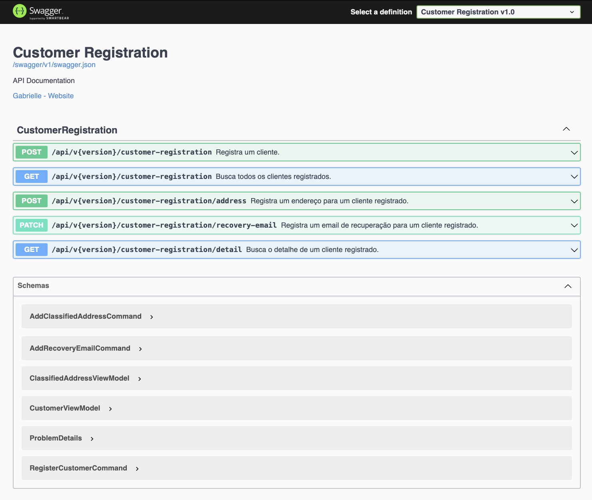
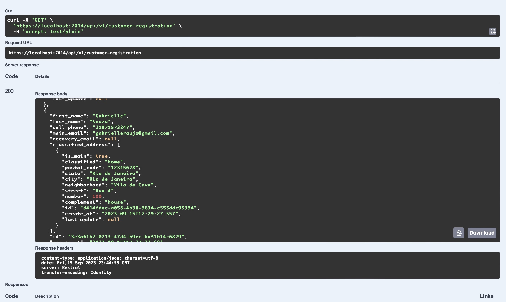

# Customer registration

### New Migration:
- para criar uma migração do banco de dados execute o comando abaixono terminal no caminho "src/CustomerRegistration.Infrastructure".
1. dotnet ef --startup-project ../CustomerRegistration.API/  migrations add initial -c CustomerRegistrationContext --msbuildprojectextensionspath local/obj -v
2. dotnet ef --startup-project ../CustomerRegistration.API/  database update

### Docker Compose:
A execuçao do script depende do container do rabbitmq ter sido inicializado para poder subir a api, o rabbitmq está no docker-compose do ms de customer_registration, o quel é o primeiro ms que deve ser inicializado.

### Executar scripts no VS Code:
Terminal > Run Task... > docker-run

### Debub no VS Code:
Run and Debug > .NET Core Docker Attach

### Abrir banco de dados no Azure Data Studio:
utilizar a connction string mudando o o server para localhost e especificar a porta configurada no docker-compose.
Ex: Server=localhost,1433

### Swagger:
- https://localhost:7014/swagger/index.html

#### Some usage examples:

